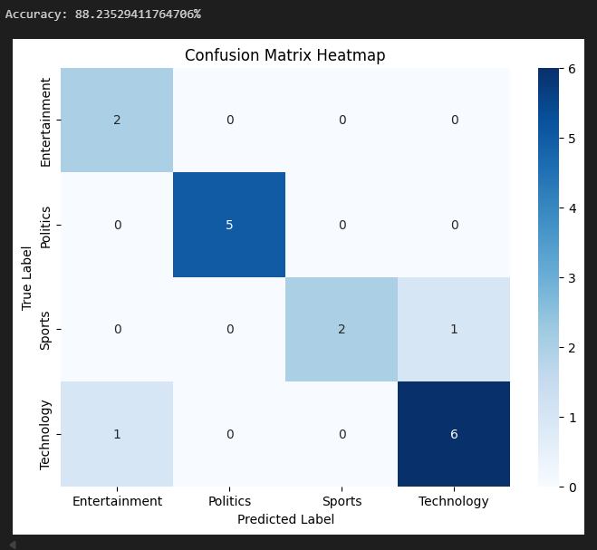

## 🧠 Text Classification using Synthetic Data

### **Overview**

This project focuses on **topic classification** of short text samples using a synthetic dataset named **`synthetic_text_data`**.
The model is trained to categorize texts into predefined topics such as **Entertainment**, **Politics**, **Sports**, and **Technology**.
It aims to explore text preprocessing, feature extraction, and classification techniques for natural language tasks.

---

### **Features**

* 🧹 Text preprocessing: tokenization, stopword removal, and vectorization
* 🤖 Machine learning–based text classification
* 📊 Performance evaluation using confusion matrix and accuracy metrics
* 🔥 Achieved an accuracy of **88.23%** on test data
* 🧠 Trained on synthetic dataset for controlled experimentation

---

### **Technologies Used**

* Python 🐍
* Pandas
* NumPy
* Scikit-learn
* Matplotlib
* Seaborn

---

### **Results**

The classifier achieved an **accuracy of 88.23%** on the test set.
The confusion matrix below shows how well the model distinguished between the four categories:

---

### **License**

This project is released under the **MIT License** — feel free to use, modify, and share.
